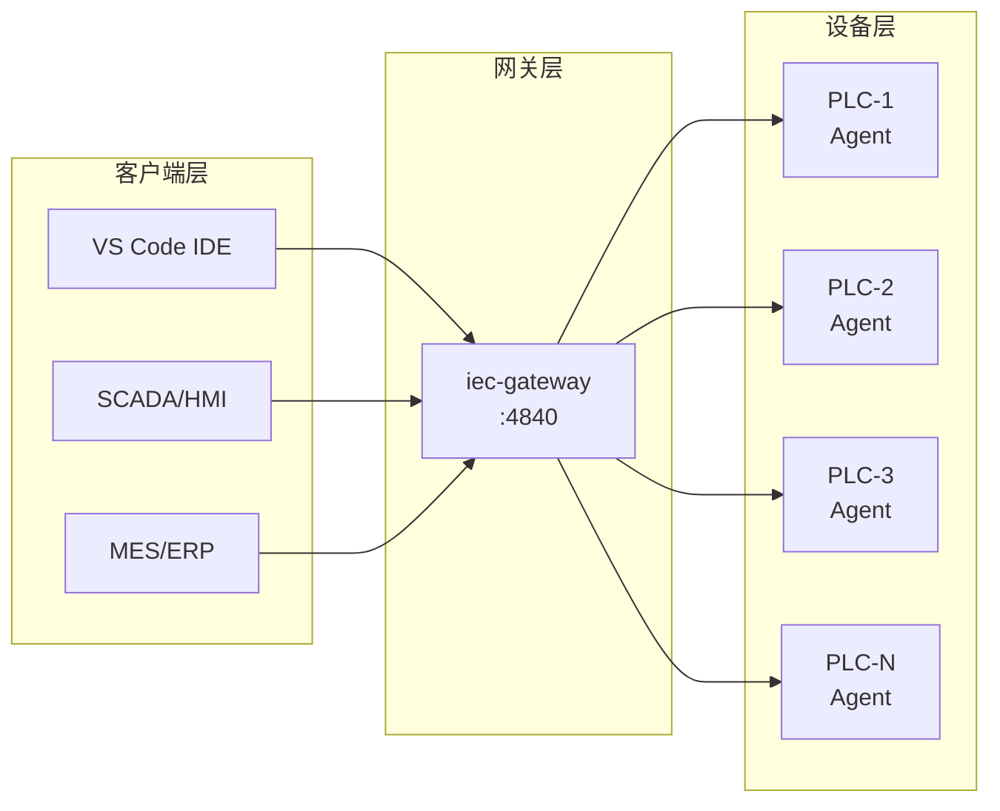
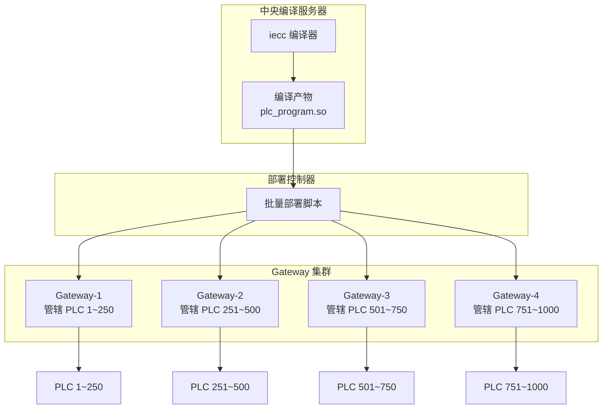
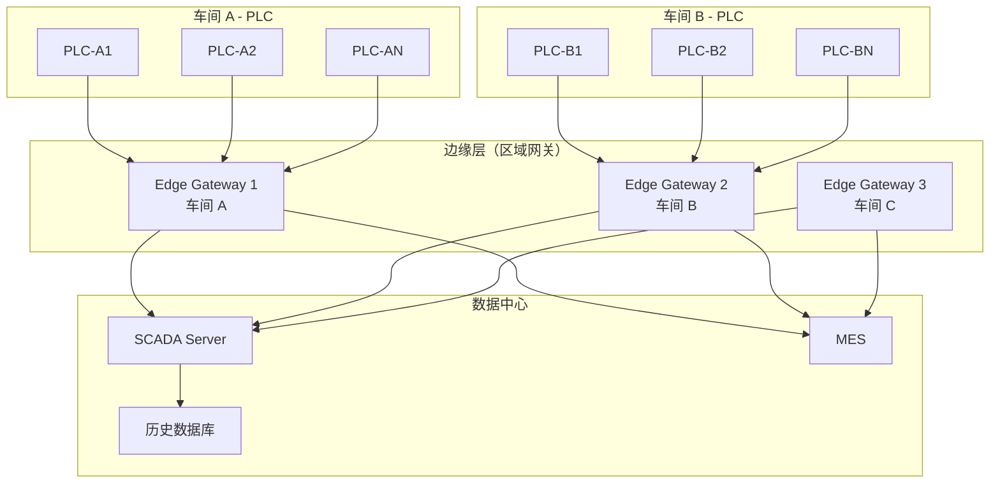

# 工业化部署架构方案 — 从单机到千台集群

本文档是一份深度的工业化架构方案白皮书，涵盖从单机 PLC 部署到千台设备集群管理的全链路，包含批量程序下发、大规模数据同步、通信协议选型、运行时可靠性保障以及生产环境最佳实践。对标 CODESYS 的部署模式，给出 IECC2 工具链在真实工业场景中的实施方案。

## 目录

- [第一部分：单机部署基础](#第一部分单机部署基础)
- [第二部分：Gateway 网关架构](#第二部分gateway-网关架构)
- [第三部分：大规模批量程序下发](#第三部分大规模批量程序下发)
- [第四部分：大规模数据同步](#第四部分大规模数据同步)
- [第五部分：通信协议矩阵](#第五部分通信协议矩阵)
- [第六部分：运行时可靠性保障](#第六部分运行时可靠性保障)
- [第七部分：生产环境最佳实践](#第七部分生产环境最佳实践)
- [第八部分：参考架构图汇总](#第八部分参考架构图汇总)

---

## 第一部分：单机部署基础

### 1.1 目标设备选择

IECC2 通过 **设备描述文件（.iecdevice.json）** 定义目标硬件参数。内置设备配置：

| 设备 | ID | 架构 | I/O | 通信协议 |
|------|------|------|-----|----------|
| Linux SoftPLC (x86_64) | `linux-x86_64` | x86_64 | DI/DO 各 8ch, AI 4ch, AO 2ch | TCP/IP, OPC UA, Modbus TCP |
| Linux SoftPLC (ARM64) | `linux-arm64` | arm64 | DI/DO 各 16ch, AI 4ch, AO 2ch | TCP/IP, Modbus TCP, EtherCAT |
| Virtual PLC (VPLC-1000) | `vplc-1000` | x86_64 | DI/DO 各 32ch, AI 8ch, AO 4ch | Modbus TCP, OPC UA |
| WASM Simulator | `wasm-sim` | wasm | Virtual DI/DO 各 8ch | WebSocket |

在 VS Code 中选择设备：命令面板 → `IEC: Select Device`

选择设备后，编译器会根据设备描述生成匹配的 I/O 映射代码。

#### 自定义设备描述

创建你自己的设备描述文件：

```json
{
  "id": "my-plc-arm",
  "name": "My Custom ARM PLC",
  "vendor": "MyCompany",
  "arch": "arm64",
  "os": "linux",
  "cpu": "Cortex-A72",
  "memory": "1024 MB",
  "ioModules": [
    { "name": "DI-0", "type": "DI", "channels": 32, "startAddress": "%IX0.0" },
    { "name": "DO-0", "type": "DO", "channels": 32, "startAddress": "%QX0.0" },
    { "name": "AI-0", "type": "AI", "channels": 16, "startAddress": "%IW0" },
    { "name": "AO-0", "type": "AO", "channels": 8, "startAddress": "%QW0" }
  ],
  "communication": [
    { "protocol": "Modbus TCP", "port": 502 },
    { "protocol": "OPC UA", "port": 4840 },
    { "protocol": "EtherCAT" }
  ]
}
```

将文件放在 `vscode-extension/devices/` 目录下，即可在设备选择面板中看到。

### 1.2 交叉编译

将 PLC 程序部署到 ARM64 嵌入式 Linux 设备的完整流程：

```bash
# 步骤 1：使用 IECC2 编译 ST → C
iecc -emit-c -link -main -o dist/plc_program.c *.st

# 步骤 2：使用 ARM64 交叉编译器编译 C → 可执行文件
aarch64-linux-gnu-gcc -o dist/plc_program dist/plc_program.c \
    -I runtime/include \
    -L runtime/lib/arm64 \
    -liec_runtime \
    -lpthread -lrt

# 步骤 3：上传到目标设备
scp dist/plc_program root@192.168.1.100:/opt/plc/
```

### 1.3 Deploy Manager 一键部署

VS Code 中集成了 Deploy Manager，支持一键完成编译、上传、启动的完整流程。

#### 配置部署目标

1. 命令面板 → `IEC: Add Deploy Target`
2. 依次输入：
   - **目标名称**：例如 `PLC-Line1-01`
   - **主机地址**：例如 `192.168.1.100`
   - **SSH 用户**：例如 `root`
   - **远程路径**：例如 `/opt/plc/`

配置保存在 `.iec/deploy_targets.json`：

```json
[
  {
    "name": "PLC-Line1-01",
    "host": "192.168.1.100",
    "port": 22,
    "user": "root",
    "remotePath": "/opt/plc/",
    "method": "ssh"
  }
]
```

#### 执行部署

1. 命令面板 → `IEC: Deploy`
2. 选择目标设备
3. 系统自动执行：
   - **编译**：`iecc -emit-c -link -main -o dist/linked.c *.st`
   - **上传**：`scp -r dist/* user@host:/opt/plc/`
   - **通知**：部署成功/失败提示

#### 远程管理

| 命令 | 说明 |
|------|------|
| `IEC: Start Remote` | SSH 连接目标设备，执行 `./iec_runtime` |
| `IEC: Stop Remote` | SSH 执行 `pkill -f iec_runtime` |

### 1.4 运行时分层架构

部署到目标设备上的 PLC 程序遵循以下分层架构：

```
┌────────────────────────────────────────────┐
│           用户 PLC 程序 (compiled C)        │
│    MainProgram, MotorControl, PID...       │
├────────────────────────────────────────────┤
│       IEC 标准库 (iec_stdlib.h)            │
│    TON, TOF, CTU, R_TRIG, ABS, SQRT...    │
├────────────────────────────────────────────┤
│        运行时核心 (iec_runtime.h)          │
│    任务调度 | 保留变量 | 看门狗 | 诊断     │
├────────────────────────────────────────────┤
│        通信层 (iec_modbus/opcua.c)         │
│    Modbus TCP/RTU | OPC UA Server/Client  │
├────────────────────────────────────────────┤
│        HAL 硬件抽象层 (iec_platform.h)     │
│    POSIX | Linux GPIO | Timer | I/O Map   │
└────────────────────────────────────────────┘
```

---

## 第二部分：Gateway 网关架构

Gateway 是 IECC2 工业化部署的**核心枢纽**，扮演 IDE / SCADA / MES 与 PLC 运行时之间的桥梁角色。

### 2.1 Gateway 的角色



- **上行**：IDE/SCADA/MES 作为客户端连接 Gateway
- **下行**：每台 PLC 运行时内嵌 Agent，主动注册到 Gateway
- **转发**：Gateway 根据 `device_id` 将请求路由到指定设备

### 2.2 设备注册与发现

#### TCP 主动注册

每台 PLC 运行时启动后，内嵌的 Agent 会自动连接 Gateway 并发送 `MsgDeviceStatus` 消息完成注册：

```
Agent 启动 → TCP 连接 Gateway:4840 → 发送 DeviceStatus → 注册成功
                                                              │
                                                         5 秒心跳
```

注册信息包含：

```json
{
  "id": "plc-line1-01",
  "name": "Line 1 - Station 01",
  "address": "192.168.1.101",
  "port": 4841,
  "platform": "linux-arm64",
  "version": "1.9.0",
  "state": "running"
}
```

#### UDP 广播发现

Gateway 同时监听 UDP 端口 4841，接收 PLC Agent 的广播公告，用于自动发现网络中的设备（无需预配置 IP 地址）：

```bash
# Gateway 自动发现新设备
[gateway] device discovery listening on UDP :4841
[gateway] discovered device via UDP: "PLC-01" at 192.168.1.101
```

#### VS Code 中扫描设备

命令面板 → `IEC: Gateway Scan`，IDE 向 Gateway 发送 `MsgScanDevices` 请求，Gateway 返回所有已注册设备列表。

### 2.3 消息协议

Gateway 使用自定义二进制协议，消息格式：

```
┌──────────┬──────────┬──────────┬───────────────┐
│ Type (2B)│ SeqID(4B)│ Len (4B) │ JSON Payload  │
└──────────┴──────────┴──────────┴───────────────┘
```

消息类型分类：

| 类别 | 消息类型 | 方向 |
|------|----------|------|
| **设备管理** | ScanDevices / ScanResult | IDE → GW → IDE |
| | Connect / Disconnect | IDE → GW |
| | DeviceStatus | PLC → GW |
| **变量访问** | VarBrowse / VarRead / VarWrite | IDE → GW → PLC → GW → IDE |
| | VarMonitor / VarUpdate | IDE ↔ GW ↔ PLC |
| **程序部署** | Upload / Download | IDE → GW → PLC |
| | StartPLC / StopPLC / ResetPLC | IDE → GW → PLC |
| | OnlineChange | IDE → GW → PLC |
| **诊断** | GetLog / GetTaskStatus | IDE → GW → PLC → GW → IDE |
| | Heartbeat | 双向 |

### 2.4 启动 Gateway

```bash
# 默认端口 4840
iec-gateway

# 指定端口和详细日志
iec-gateway -port 4840 -v
```

VS Code 中连接 Gateway：
- 命令面板 → `IEC: Gateway Connect`
- 或点击状态栏 Gateway 状态项

---

## 第三部分：大规模批量程序下发

### 场景 1：1000+ 台 PLC 同一程序批量下发

**典型场景**：一条生产线上 1000 台相同的设备（如包装机、注塑机控制器），需要统一升级控制程序。

#### 架构方案



#### 实施步骤

**步骤 1：集中编译**

在中央编译服务器上编译一次，生成统一的部署产物：

```bash
iecc -emit-c -link -main -o dist/plc_v2.0.c src/*.st
aarch64-linux-gnu-gcc -shared -o dist/plc_v2.0.so dist/plc_v2.0.c \
    -I runtime/include -L runtime/lib/arm64 -liec_runtime
```

**步骤 2：分组部署**

将 1000 台设备按区域/产线分组，每组分配一个 Gateway：

```json
{
  "groups": [
    {
      "name": "Line-1",
      "gateway": "192.168.1.1:4840",
      "devices": ["plc-001", "plc-002", "...", "plc-250"]
    },
    {
      "name": "Line-2",
      "gateway": "192.168.2.1:4840",
      "devices": ["plc-251", "plc-252", "...", "plc-500"]
    }
  ]
}
```

**步骤 3：灰度发布**

不要一次性下发所有设备，采用灰度发布策略：

```
阶段 1 (5%)：  选择 50 台测试设备 → 下发 → 运行 24h 观察
阶段 2 (20%)： 扩展到 200 台 → 运行 12h 观察
阶段 3 (50%)： 扩展到 500 台 → 运行 4h 观察
阶段 4 (100%)：全量下发
```

每个阶段的下发通过 Gateway 的 `MsgDownload` 消息执行：

```bash
# 批量下发脚本示例（伪代码）
for device_id in $DEVICE_LIST; do
    # 通过 Gateway 下发程序
    gateway-cli download \
        --gateway $GATEWAY_ADDR \
        --device $device_id \
        --program dist/plc_v2.0.so

    # 验证下发结果
    gateway-cli status --device $device_id

    echo "[$device_id] deployed successfully"
done
```

**步骤 4：回滚机制**

每次部署前备份当前版本：

```
/opt/plc/
├── current/         → 指向当前运行版本的软链接
├── v1.9.0/          → 上一个版本（保留）
├── v2.0.0/          → 新版本
└── rollback.sh      → 一键回滚脚本
```

回滚脚本：

```bash
#!/bin/bash
ln -sfn /opt/plc/v1.9.0 /opt/plc/current
pkill -f iec_runtime
cd /opt/plc/current && ./iec_runtime &
echo "Rolled back to v1.9.0"
```

### 场景 2：差异化程序下发

**典型场景**：100 台搅拌机控制器，控制程序相同，但每台设备的搅拌速度、温度设定值等参数不同。

#### 方案：基础程序 + 参数化配置

```
┌─────────────────┐     ┌─────────────────┐
│  基础程序 (统一)  │     │ 设备配置 (差异化) │
│  Mixer.st        │  +  │ config-001.json  │
│  PID.st          │     │ config-002.json  │
│  Safety.st       │     │ config-N.json    │
└─────────────────┘     └─────────────────┘
```

**基础程序**通过全局变量引用配置参数：

```iec
VAR_GLOBAL
    cfg_mix_speed : REAL := 100.0;    (* 由配置文件覆盖 *)
    cfg_temp_sp : REAL := 75.0;       (* 由配置文件覆盖 *)
    cfg_mix_time : TIME := T#30s;     (* 由配置文件覆盖 *)
    cfg_device_id : STRING := '';     (* 设备标识 *)
END_VAR
```

**每台设备的配置文件**（`config-001.json`）：

```json
{
  "device_id": "mixer-001",
  "parameters": {
    "cfg_mix_speed": 120.0,
    "cfg_temp_sp": 80.0,
    "cfg_mix_time": "T#45s"
  }
}
```

**部署流程**：

1. 编译基础程序（统一）
2. 下发程序到所有设备
3. 下发各设备的配置文件
4. 运行时加载配置文件并覆盖全局变量初始值

也可以利用 IECC2 的**配方管理**功能，通过 Recipe Manager 面板管理设备参数集。

---

## 第四部分：大规模数据同步

### 场景 3：千台 PLC 数据汇聚到 SCADA/MES

**典型场景**：工厂中 1000 台 PLC 的运行数据需要实时汇聚到中央 SCADA 系统或 MES 系统。

#### 分层采集架构



#### 数据采集方式

IECC2 的 PLC 运行时提供三种数据采集接口，可根据 SCADA/MES 系统的能力选择：

**方式 A：Modbus TCP 轮询（兼容性最强）**

每台 PLC 运行 Modbus TCP 从站（端口 502），SCADA 作为 Modbus 主站轮询数据：

```
SCADA → Modbus TCP 读取 → PLC:502
```

地址映射：
| Modbus 区域 | PLC 地址 | 说明 |
|-------------|----------|------|
| Coils (0x) | %QX | 输出位 |
| Discrete Inputs (1x) | %IX | 输入位 |
| Input Registers (3x) | %IW | 输入字 |
| Holding Registers (4x) | %QW + %MW | 输出字 + 内存字 |

**方式 B：OPC UA REST 接口（语义化访问）**

每台 PLC 运行 OPC UA 模拟服务，提供 RESTful API：

```bash
# 浏览所有变量
GET http://plc-001:4840/opcua/browse

# 读取指定变量
GET http://plc-001:4840/opcua/read?nodeId=ns=1;s=%IW0

# 写入变量
POST http://plc-001:4840/opcua/write
{"nodeId": "ns=1;s=%QW0", "value": 1500}
```

OPC UA 的优势在于语义化的变量命名空间（`ns=1;s=%IW0`），比 Modbus 的纯数字地址更易管理。

**方式 C：Gateway 订阅推送（实时性最好）**

通过 Gateway 的 `MsgVarMonitor` 订阅变量变化，PLC 在值变化时主动推送 `MsgVarUpdate`：

```
SCADA → VarMonitor(device_id, var_list) → Gateway → PLC
                                                      │
PLC 值变化 → VarUpdate → Gateway → SCADA              │
```

这种方式的数据实时性最好，且避免了轮询带来的网络开销。

#### 数据采集频率与网络规划

| 场景 | 推荐频率 | 每台 PLC 带宽 | 1000 台总带宽 |
|------|----------|---------------|---------------|
| 状态监控 | 1 Hz | ~1 KB/s | ~1 MB/s |
| 过程数据 | 10 Hz | ~10 KB/s | ~10 MB/s |
| 高速采集 | 100 Hz | ~100 KB/s | ~100 MB/s |
| 事件驱动 | 变化触发 | ~0.5 KB/s | ~500 KB/s |

**建议**：对于 1000+ 台设备，推荐采用 **分层架构 + 事件驱动**，在区域 Gateway 做数据预处理和聚合，减少到数据中心的带宽压力。

### 场景 4：PLC 间数据互通

**典型场景**：流水线上相邻的两台 PLC 需要交换握手信号和工件数据。

#### 方案 A：通过 Gateway 变量空间

两台 PLC 都注册到同一个 Gateway，IDE 客户端可以读写任意设备的变量，间接实现数据交换：

```
PLC-A 写入变量 → Agent → Gateway → Agent → PLC-B 读取变量
```

#### 方案 B：Modbus 主从通信

PLC-A 作为 Modbus 主站，读取 PLC-B 的 Modbus 从站寄存器：

```iec
VAR
    mbClient : MODBUS_TCP_CLIENT;
    remoteTemp : INT;
END_VAR

mbClient(
    host := '192.168.1.102',
    port := 502,
    unitId := 1,
    functionCode := 3,        (* Read Holding Registers *)
    startAddress := 0,
    quantity := 1
);
remoteTemp := mbClient.data[0];
```

#### 方案 C：OPC UA 发布/订阅

利用 OPC UA 的发布/订阅模型（Pub/Sub），PLC-A 发布数据，PLC-B 订阅接收：

```iec
VAR
    pub : OPCUA_WRITE;
    sub : OPCUA_READ;
END_VAR

(* PLC-A: 发布工件数据 *)
pub(nodeId := 'ns=1;s=workpiece_count', value := count);

(* PLC-B: 订阅工件数据 *)
sub(host := '192.168.1.101', nodeId := 'ns=1;s=workpiece_count');
received_count := sub.value;
```

### 场景 5：与上位系统集成

#### MQTT → 云平台 / IoT Hub

```iec
VAR
    mqtt : MQTT_CLIENT;
    pub : MQTT_PUBLISH;
END_VAR

mqtt(broker := 'tcp://iot-hub.example.com:1883', clientId := 'plc-001');

pub(
    client := mqtt,
    topic := 'factory/line1/plc001/data',
    payload := CONCAT('{"temp":', REAL_TO_STRING(temperature), '}'),
    qos := 1
);
```

#### OPC UA → MES/ERP

通过 OPC UA 标准接口，MES/ERP 系统可以直接读写 PLC 变量：

```
MES → OPC UA Client → PLC OPC UA Server → PLC 变量
```

IECC2 编译器支持 `-emit-nodeset` 选项，从程序自动生成 OPC UA NodeSet2 XML，方便 MES 系统导入变量定义。

#### IEC 104 → 电力 SCADA

```iec
VAR
    iec104 : IEC104_SERVER;
END_VAR

iec104(
    port := 2404,
    commonAddr := 1
);
(* 遥测量和遥信量自动映射到 I/O 变量 *)
```

#### REST API → 自定义系统

VPLC 引擎提供内置的 WebSocket 和 HTTP API：

```bash
# WebSocket 实时数据流
ws://plc:8090/ws

# HTTP API - 获取 I/O 状态
GET http://plc:8090/api/io

# HTTP API - 获取任务状态
GET http://plc:8090/api/tasks
```

---

## 第五部分：通信协议矩阵

### 协议选型指南

| 协议 | 实时性 | 兼容性 | 适用场景 | IECC2 支持 |
|------|--------|--------|----------|------------|
| **Modbus TCP** | 中 | 极高 | 传统设备互联、SCADA 采集 | 内置从站 + 标准库客户端 FB |
| **OPC UA** | 中 | 高 | 工业 4.0、MES/ERP 集成 | REST 模拟服务 + 标准库 FB + NodeSet 导出 |
| **MQTT** | 低 | 高 | IoT/云平台、边缘计算 | 标准库 FB |
| **EtherCAT** | 极高 | 中 | 伺服控制、高速 I/O | 标准库 FB |
| **PROFINET** | 高 | 中 | Siemens 生态互联 | 标准库 FB |
| **EtherNet/IP** | 高 | 中 | Rockwell 生态互联 | 标准库 FB |
| **S7 Comm** | 中 | 中 | 与 Siemens S7 PLC 互联 | 标准库 FB |
| **CANopen** | 中 | 中 | 嵌入式设备、机器人 | 标准库 FB |
| **BACnet** | 低 | 高 | 楼宇自动化 | 标准库 FB |
| **IEC 104** | 中 | 高 | 电力调度、变电站自动化 | 标准库 FB + C 实现 |
| **Modbus RTU** | 中 | 极高 | 串口设备、老旧仪表 | 标准库 FB |

### 标准库协议 FB 使用方法

所有协议 FB 位于 `stdlib/` 的 L3 协议库中，使用前需在库管理器中添加对应的协议库。

协议库分布：

| 库 | 文件 | 包含 FB |
|----|------|---------|
| Communication | `iecv1_comm.st` | CONNECT, SEND, RECEIVE, USEND, URCV |
| Modbus | `iecv1_modbus.st` | MODBUS_TCP_CLIENT, MODBUS_READ_REGISTERS, ... |
| MQTT | `iecv1_mqtt.st` | MQTT_CLIENT, MQTT_PUBLISH, MQTT_SUBSCRIBE |
| OPC UA | `iecv1_opcua.st` | OPCUA_CLIENT, OPCUA_READ, OPCUA_WRITE |
| S7 Comm | `iecv1_s7comm.st` | S7_CLIENT, S7_READ_DB, S7_WRITE_DB |
| CANopen | `iecv1_canopen.st` | CANOPEN_MASTER, CANOPEN_SDO_READ, ... |
| BACnet | `iecv1_bacnet.st` | BACNET_CLIENT, BACNET_READ_PROPERTY |
| IEC 104 | `iecv1_iec104.st` | IEC104_CLIENT, IEC104_SERVER |
| EtherCAT | `iecv1_ethercat.st` | EC_MASTER, EC_SLAVE_READ |
| PROFINET | `iecv1_profinet.st` | PN_CONTROLLER, PN_DEVICE_IO |
| EtherNet/IP | `iecv1_ethernet_ip.st` | EIP_SCANNER, EIP_ADAPTER |

---

## 第六部分：运行时可靠性保障

### 6.1 任务调度与看门狗

VPLC 引擎的任务调度器支持周期任务和事件任务：

```json
{
  "cpu": {
    "cycleTimeUs": 1000,
    "maxTasks": 16,
    "watchdogMs": 500
  }
}
```

| 参数 | 说明 |
|------|------|
| `cycleTimeUs` | 主任务扫描周期（微秒），1000 = 1ms |
| `maxTasks` | 最大并发任务数 |
| `watchdogMs` | 看门狗超时（毫秒），单次扫描超时则触发告警 |

看门狗机制：
- 每次扫描开始时启动计时
- 如果扫描执行时间超过 `watchdogMs`，记录一次 **Overrun**
- 连续 Overrun 可配置为触发 PLC 停止或告警

可通过 `GetTaskStatus` 诊断消息查看任务统计：

```json
{
  "name": "MainTask",
  "state": "running",
  "cycle_time_us": 1000,
  "max_time_us": 850,
  "overruns": 0
}
```

### 6.2 保留变量持久化

VPLC 使用 CRC32 校验 + 双缓冲文件写入保证保留变量的可靠性：

```
写入流程：
  数据 → CRC32 计算 → 写入 retain.A → 写入 retain.B
                        （双缓冲，避免单点故障）

恢复流程：
  读取 retain.A → CRC32 校验 → 校验通过 → 恢复
                                 校验失败 → 读取 retain.B → 重试
```

文件格式：
```
┌──────────┬──────────┬──────────────────┐
│ Size (4B)│ CRC (4B) │  Data (N bytes)  │
└──────────┴──────────┴──────────────────┘
```

配置保留内存大小：

```json
{
  "cpu": {
    "retainMemoryKB": 64
  }
}
```

在 ST 程序中声明保留变量：

```iec
VAR RETAIN
    totalRunHours : DINT := 0;
    batchCount : DINT := 0;
    lastRecipe : INT := 0;
END_VAR
```

### 6.3 掉电恢复策略

| 事件 | 处理 |
|------|------|
| 正常关机 | 保存保留变量 → 关闭通信 → 停止调度 |
| 非正常掉电 | 下次启动时从 retain 文件恢复保留变量 |
| CRC 校验失败 | 尝试备份文件（retain.B），若仍失败则使用默认值 |
| 程序更新 | 可选择保留或清空保留变量 |

### 6.4 故障诊断与日志

运行时维护一个环形诊断日志（最多 1000 条），记录：

- 程序加载/卸载事件
- PLC 启动/停止事件
- 看门狗超时告警
- 通信连接/断开事件
- 错误和异常

通过 Gateway 的 `MsgGetLog` 消息远程获取日志：

```json
[
  { "time": "2026-02-23T10:00:00Z", "level": "info", "message": "PLC started" },
  { "time": "2026-02-23T10:00:01Z", "level": "info", "message": "Modbus TCP slave started on port 502" },
  { "time": "2026-02-23T10:05:32Z", "level": "warning", "message": "MainTask overrun: 1200us > 1000us" }
]
```

### 6.5 在线变更（Online Change）

IECC2 支持不停机更新程序逻辑：

1. 修改 ST 源代码
2. 命令面板 → `IEC: Online Change`
3. 编译器计算差异，生成增量更新包
4. 通过 Gateway 的 `MsgOnlineChange` 消息下发
5. 运行时在下一个扫描周期边界应用更新
6. 保留变量值不受影响

**适用条件**：
- 仅修改程序逻辑（语句、表达式）
- 不增删变量定义
- 不改变功能块接口

**不适用时**需要完全停机更新。

---

## 第七部分：生产环境最佳实践

### 7.1 项目结构规范

推荐的生产级项目结构：

```
production-project/
├── src/                    (* ST 源代码 *)
│   ├── programs/           (* 程序 *)
│   │   └── MainProgram.st
│   ├── function_blocks/    (* 功能块 *)
│   │   ├── PID_Controller.st
│   │   ├── MotorControl.st
│   │   └── AlarmHandler.st
│   ├── functions/          (* 函数 *)
│   │   └── Utilities.st
│   ├── types/              (* 数据类型 *)
│   │   └── DataTypes.st
│   ├── globals/            (* 全局变量 *)
│   │   └── GlobalVars.st
│   └── graphics/           (* 图形化程序 *)
│       ├── SafetyLogic.ld.json
│       └── SequenceCtrl.sfc.json
├── config/                 (* 配置 *)
│   ├── device.iecdevice.json
│   ├── deploy_targets.json
│   └── vplc.json
├── hmi/                    (* HMI 画面 *)
│   └── Dashboard.hmi.json
├── test/                   (* 测试 *)
│   └── test_pid.st
├── dist/                   (* 编译输出 *)
├── .iec/                   (* 项目配置 *)
└── README.md
```

### 7.2 版本控制策略

```
main             ─────●──────●──────●──────▶
                      │      │      │
release/v1.0  ────────●──────┤      │
                             │      │
release/v2.0  ───────────────●──────┤
                                    │
release/v3.0  ──────────────────────●
```

- **main 分支**：开发主线
- **release/vX.Y**：发布分支，部署到生产环境
- **编译产物版本化**：每次发布生成带版本号的编译产物
- **部署回滚**：目标设备保留最近 3 个版本

```bash
# 版本化构建
iecc -emit-c -link -main -o dist/plc_v3.0.c src/**/*.st
# 编译产物打包
tar czf releases/plc_v3.0_arm64.tar.gz dist/ runtime/
```

### 7.3 测试策略

```
┌──────────────────────────────────────────────┐
│  第 1 层：单元测试（开发阶段）                 │
│  - 每个功能块独立测试                         │
│  - 使用 iec-sim 快速验证逻辑                  │
│  - 覆盖边界条件和异常输入                     │
├──────────────────────────────────────────────┤
│  第 2 层：仿真测试（集成阶段）                 │
│  - VPLC 完整系统仿真                          │
│  - 信号发生器模拟传感器输入                    │
│  - 故障注入测试容错处理                       │
│  - 通信协议联调                              │
├──────────────────────────────────────────────┤
│  第 3 层：硬件在环测试（验证阶段）             │
│  - 连接真实 I/O 模块                          │
│  - 半物理仿真（真实硬件 + 模拟工况）           │
├──────────────────────────────────────────────┤
│  第 4 层：现场验证（部署阶段）                 │
│  - 单台设备试运行                             │
│  - 生产工况全流程验证                         │
│  - 性能和稳定性长时间测试                     │
└──────────────────────────────────────────────┘
```

### 7.4 报警与配方管理

#### 报警管理

命令面板 → `IEC: Open Alarms` 打开报警管理面板：

- 定义报警条件（变量阈值、状态组合）
- 设置报警优先级和延时确认
- 报警历史记录和统计
- 支持 TON 延时避免瞬态误报

#### 配方管理

命令面板 → `IEC: Open Recipe` 打开配方管理面板：

- 定义配方参数集（不同产品的工艺参数）
- 一键切换配方（更新全局变量）
- 配方导入/导出
- 配方版本管理

### 7.5 安全建议

| 方面 | 建议 |
|------|------|
| **SSH 密钥** | 使用密钥认证替代密码，禁用 root 密码登录 |
| **网络隔离** | PLC 网络与办公网络物理隔离，Gateway 部署在 DMZ |
| **防火墙** | 仅开放必要端口：502 (Modbus), 4840 (Gateway/OPC UA), 8090 (WebSocket) |
| **通信加密** | Gateway 连接使用 TLS，OPC UA 使用安全策略 |
| **访问控制** | Deploy Manager 仅授权给运维人员 |
| **审计日志** | 记录所有部署操作和远程访问 |

### 7.6 监控仪表盘

VPLC 引擎内置 WebSocket 实时数据推送，配合 WSMonitor 提供：

- **实时 I/O 数据**：所有通道的当前值
- **任务执行统计**：周期时间、最大时间、超时计数
- **PLC 状态**：运行/停止/故障
- **诊断日志流**：实时推送系统事件

连接方式：

```javascript
const ws = new WebSocket('ws://plc:8090/ws');
ws.onmessage = (event) => {
    const data = JSON.parse(event.data);
    // data.io — I/O 状态
    // data.tasks — 任务统计
    // data.state — PLC 状态
};
```

Trace 示波器（命令面板 → `IEC: Open Trace`）提供变量的时间序列可视化，适合观察控制回路的动态行为。

---

## 第八部分：参考架构图汇总

### 架构 A：单机部署（1 台 PLC）

```
┌──────────┐         ┌──────────────────────┐
│ VS Code  │──SSH──▶│  Target Device        │
│   IDE    │──SCP──▶│  ┌──────────────────┐ │
│          │        │  │  iec_runtime      │ │
│          │        │  │  ├── User Program │ │
│          │        │  │  ├── Stdlib       │ │
│          │        │  │  ├── Modbus:502   │ │
│          │        │  │  └── HAL          │ │
│          │        │  └──────────────────┘ │
└──────────┘        └──────────────────────┘
```

适用场景：原型开发、单台设备调试、小型项目。

### 架构 B：小型产线（10-50 台 PLC）

```
┌──────────┐    ┌────────────┐    ┌──────┐
│ VS Code  │───▶│  Gateway   │───▶│PLC-01│
│   IDE    │    │  :4840     │───▶│PLC-02│
└──────────┘    │            │───▶│ ...  │
                │  UDP:4841  │───▶│PLC-50│
┌──────────┐    │  (发现)     │    └──────┘
│  SCADA   │───▶│            │
└──────────┘    └────────────┘
```

适用场景：单条产线、小型车间。所有设备通过一个 Gateway 管理。

### 架构 C：中型工厂（100-500 台 PLC）

```
┌──────────────────────────────────────────────────┐
│                  中央管理层                        │
│  ┌──────────┐  ┌──────────┐  ┌──────────────────┐│
│  │  IDE     │  │  SCADA   │  │  MES / Historian ││
│  └────┬─────┘  └────┬─────┘  └────────┬─────────┘│
│       └──────────────┼─────────────────┘          │
└──────────────────────┼────────────────────────────┘
                       │
┌──────────────────────┼────────────────────────────┐
│               区域 Gateway 层                      │
│  ┌────────────┐  ┌───┴────────┐  ┌────────────┐  │
│  │  GW-A      │  │  GW-B      │  │  GW-C      │  │
│  │  车间 A     │  │  车间 B     │  │  车间 C     │  │
│  └─────┬──────┘  └─────┬──────┘  └─────┬──────┘  │
│        │               │               │         │
│  ┌─────▼─────┐   ┌─────▼─────┐   ┌─────▼─────┐  │
│  │PLC 1~150  │   │PLC 151~350│   │PLC 351~500│  │
│  └───────────┘   └───────────┘   └───────────┘  │
└───────────────────────────────────────────────────┘
```

适用场景：多车间工厂、需要分区管理的场景。

### 架构 D：大型集群（1000+ 台 PLC）

```
┌────────────────────────────────────────────────────────┐
│                    云端 / 数据中心                       │
│  ┌──────┐  ┌──────┐  ┌──────────┐  ┌───────────────┐  │
│  │ MES  │  │ ERP  │  │ Historian│  │  IoT Platform │  │
│  └──┬───┘  └──┬───┘  └────┬─────┘  └───────┬───────┘  │
│     └─────────┴───────────┴─────────────────┘          │
│                           │                            │
│                    ┌──────▼───────┐                     │
│                    │  中央 SCADA   │                     │
│                    └──────┬───────┘                     │
└───────────────────────────┼────────────────────────────┘
                            │
┌───────────────────────────┼────────────────────────────┐
│                    边缘聚合层                           │
│  ┌─────────┐  ┌──────────┴┐  ┌─────────┐              │
│  │Edge GW-1│  │Edge GW-2  │  │Edge GW-N│              │
│  │数据聚合  │  │数据聚合    │  │数据聚合  │              │
│  │协议转换  │  │协议转换    │  │协议转换  │              │
│  └────┬────┘  └─────┬─────┘  └────┬────┘              │
└───────┼─────────────┼─────────────┼────────────────────┘
        │             │             │
┌───────┼─────────────┼─────────────┼────────────────────┐
│       │    现场 Gateway 层        │                     │
│  ┌────▼────┐   ┌────▼────┐  ┌────▼────┐               │
│  │ GW-1a  │   │ GW-2a  │  │ GW-Na  │               │
│  │ GW-1b  │   │ GW-2b  │  │ GW-Nb  │               │
│  └───┬────┘   └───┬────┘  └───┬────┘               │
│      │            │           │                     │
│  ┌───▼─────┐ ┌───▼─────┐ ┌──▼──────┐               │
│  │PLC ×250 │ │PLC ×250 │ │PLC ×250 │               │
│  └─────────┘ └─────────┘ └─────────┘               │
└─────────────────────────────────────────────────────┘
```

适用场景：大型工厂、多厂区、需要云端集成的场景。

关键设计要点：
- **分层**：现场 → 边缘 → 云端，逐层聚合减少数据量
- **冗余**：关键 Gateway 做主备切换
- **独立性**：即使上层断开，现场 PLC 继续独立运行
- **弹性**：可按需增加 Gateway 节点扩展管理容量

### 与 CODESYS 部署模式对照

| 能力 | CODESYS | IECC2 |
|------|---------|-------|
| 开发环境 | CODESYS IDE（专用软件） | VS Code + 扩展（开放平台） |
| 设备管理 | CODESYS Gateway | iec-gateway |
| 设备发现 | 网络扫描 | UDP 广播 + TCP 注册 |
| 程序下载 | CODESYS 协议 | Gateway MsgDownload / SSH+SCP |
| 在线监控 | CODESYS Online | Monitor/VarTable/Trace 面板 |
| 在线变更 | Online Change | MsgOnlineChange |
| 通信协议 | 内置 + 第三方库 | 标准库 FB（20+ 协议） |
| 运行时 | CODESYS Runtime（商用授权） | SoftPLC Runtime（开源/自主） |
| 多设备管理 | 单 Gateway 管理多设备 | 分层 Gateway 集群 |
| HMI | CODESYS Visualization | 内置 HMI Designer |
| 授权模式 | 按设备/按功能收费 | MIT 开源许可 |

---

**上一步**：[高级开发](高级开发.md)
**回到首页**：[Home](Home.md)
